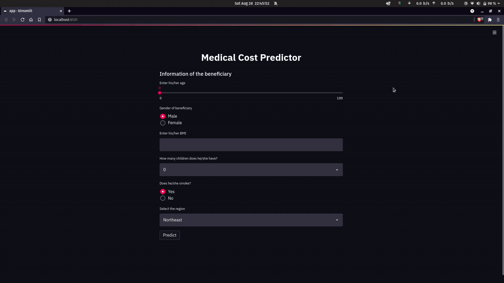

<h1 align="center"> Medical Cost Prediction </h1>
Why do we need a health insurance you might ask, especially if you're generally healthy. But there are many reasons for having one. First, your health matters the most, and health insurance is a way of helping protect your health. <br>
Here are fews ways health insurances can protect you : -

1. Health insurances are designed to help prepare for unexpected moments in your life, like accidents or illness.
2. Without health insurance, you could be faced with paying medical bills yourself, and health care can be expensive.
3. Health insurance can keep you on track with preventive care — which may be covered by insurance at 100%, in many cases. Regular doctor visits may help you stay healthier over time.

Anyone can get a health insurance irrespective of their age, sex, or their place of living. And this project helps them to get an estimate of the price of their health insurance based on the factors listed below.


----
<h2> Factors </h2>

1. **Age** - Age of primary beneficiary
2. **Sex** - Gender of primary beneficiary
3. **BMI** - Body Mass Index (kg / m^2). Ideal range is between 18.5 to 24.9
4. **Children** - Number of children covered by health insurance / Number of dependents
5. **Smoker** - Does the beneficiary smoke?
6. **Region** - The beneficiary's residential area in the US, northeast, northwest, southeast, southwest

----
<h2> How to use the project </h2>

1. Installing the required softwares:-
    ```bash
    pip install -r requirements.txt
    ```
2. Cloning the repository:- 
    ```bash
    git clone https://github.com/archihalder/Medical-Cost-Prediction.git
    ```
3. Change the directory:-
    ```bash
    cd Medical-Cost-Prediction
    ```
4. Run the web app:-
    ```bash
    streamlit run app.py
    ```
5. To close the app from the terminal, press Ctrl+C.

----
<h2> Demo </h2>

